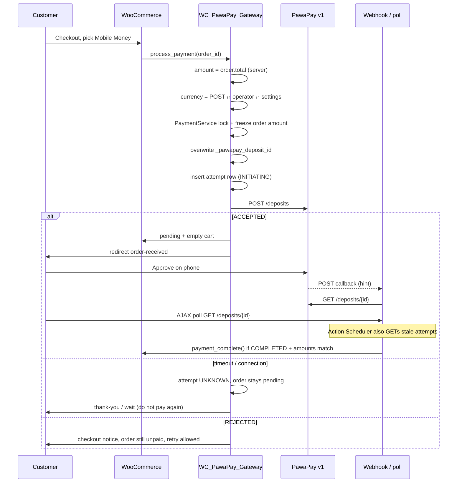

# Payment flow

Observed on plugin **2.2.0**. Live Maungano deposits completed on the 1.2.1 path; 1.3–2.2 add attempts, a v1 client, initiate lock, GET-before-complete, a waiting screen, and background reconciliation.

## Current flow (as implemented)

## What is already correct

- Woo creates the order before the deposit.
- Payable **amount** comes from `$order->get_total()`, not from JavaScript.
- Charge **currency** is chosen at checkout but converted on the server.
- Browser reload of thank-you does not mark paid by itself; JS only polls, then the server calls PawaPay.
- Waiting card is dedicated copy; poll JSON is a sanitized DTO.
- `payment_complete()` is the only path that moves a pending order to paid.

## What is not yet the target

- `_pawapay_deposit_id` is still a latest-deposit pointer. A retry overwrites that meta key; earlier deposits remain in the attempts table.
- Full RFC 9421 ECDSA callback signatures are not verified yet.
- Poll is adaptive but not rate-limited (Phase 9).
- Reconciliation stops after 48 hours; admin “Check PawaPay status” remains for older rows.

## Target flow

See `docs/implementation-plan.md` Phase 3–6. Browser stays non-authoritative. Paid state only after verified callback **or** authenticated `GET /deposits/{id}` **or** background reconciliation.
