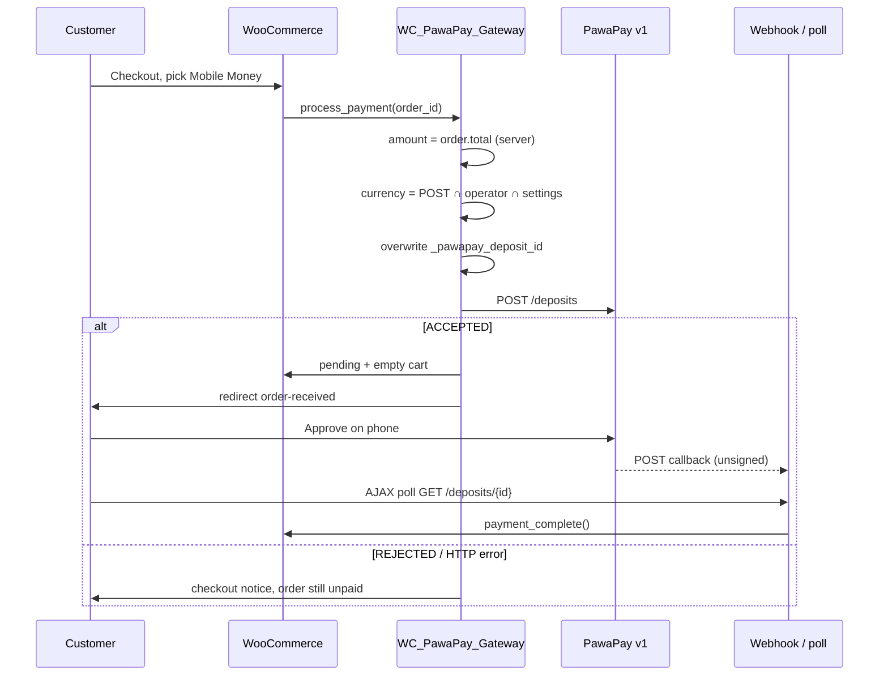

# Payment flow

Observed on plugin **1.2.1** (`d50762c`). Live Maungano deposits have completed with this path.

## Current flow (as implemented)

## What is already correct

- Woo creates the order before the deposit.
- Payable **amount** comes from `$order->get_total()`, not from JavaScript.
- Charge **currency** is chosen at checkout but converted on the server.
- Browser reload of thank-you does not mark paid by itself; JS only polls, then the server calls PawaPay.
- `payment_complete()` is the only path that moves a pending order to paid.

## What is not yet the target

- Redirect on `ACCEPTED` is the normal Woo thank-you page plus a banner, not a dedicated waiting screen.
- One order stores **one** deposit id. A retry overwrites the previous attempt.
- Webhook JSON `status` is applied without cryptographic verification and without re-fetching PawaPay (poll does re-fetch).
- `FAILED` / `REJECTED` on the deposit sets the **Woo order** to `failed`, which blocks Pay again on that order.
- No Action Scheduler reconciliation if the customer leaves and the webhook never arrives (admin “Check PawaPay status” is manual only).

## Target flow

See `docs/implementation-plan.md` Phase 3–6. Browser stays non-authoritative. Paid state only after verified callback **or** authenticated `GET /deposits/{id}` **or** background reconciliation.
